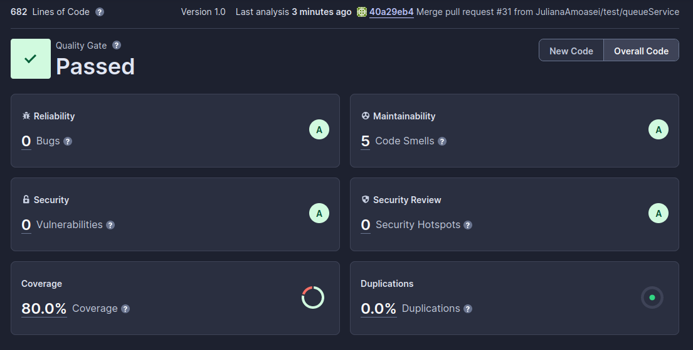
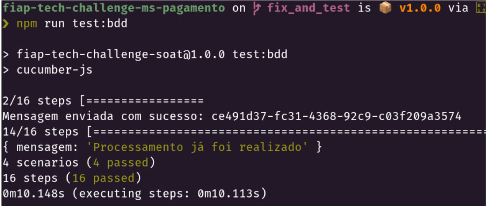
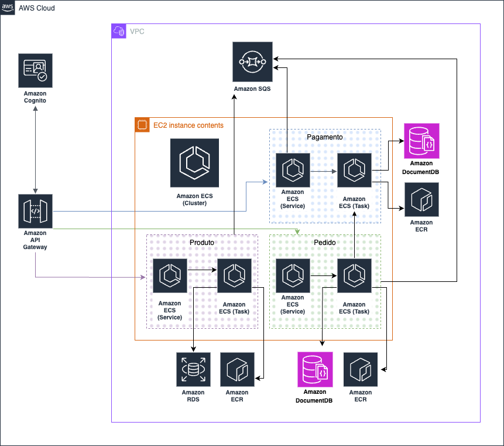

# Tech Challenge - Pós-Tech SOAT - FIAP

Este é o projeto desenvolvido durante a fase I e atualizado durante a fase IV do curso de pós-graduação em arquitetura de software da FIAP - turma II/2023.

Membros do grupo 30:
Diórgenes Eugênio da Silveira - RM 349116
Elton de Andrade Rodrigues - RM 349353
Gabriel Mendes - RM 348989
Juliana Amoasei dos Reis - RM 348666

### Changelog Fase IV:
* **Microsserviço de pagamentos**: separação da funcionalidade de pagamentos em um microsserviço isolado;
* **Migração de banco de dados**: separação de base de dados exclusiva do serviço de pagamentos para o MongoDB/DocumentDB;
* **Implementação de testes**: Testes unitários e de integração com cobertura de 80%; testes BDD com cucumber.js;
* **Qualidade de código**: proteção da branch `main`, integração de código via PR e implementação de tarefas de CI para testes via GitHub Actions;
* **Deploy automatizado**: implementação de tarefas de CI para deploy automatizado das atualizações via GitHub Actions.


## Propósito do projeto

Fornecer um sistema para gerenciamento de pedidos para uma empresa do ramo de serviços de alimentação.

## Stack utilizada

* Node.js v20
* TypeScript 
* MongoBD/Mongoose
* Express
* Docker
* AWS
  * DocumentDB
  * SQS
  * ECS


## Instalação do projeto

Este projeto está pronto para ser executado em um ambiente Docker. Por este motivo, será necessária apenas a instalação do Docker e/ou Kubernetes, não sendo necessária a instalação manual do projeto. Também não será necessária a instalação manual do banco de dados (MongoDB).

Caso não tenha o Docker instalado, siga as instruções para seu sistema operacional na documentação oficial do Docker.

Para executar em ambiente de desenvolvimento:

* Faça o fork e clone este repositório em seu computador;
* Entre no diretório local onde o repositório foi clonado;
* Execute o código utilizando o Docker.

### Docker Compose

Utilize o comando `docker compose up` para subir o servidor local, expondo a porta 3000 em localhost. Além do container da api também subirá o serviço db com o banco de dados de desenvolvimento.

IMPORTANTE: Esta API está programada para ser acessada a partir de http://localhost:3000 e o banco de dados utiliza a porta 27017. Certifique-se de que não existam outros recursos ocupando as portas 3000 e 27017 antes de subir o projeto.

Para derrubar o serviço, execute o comando docker compose down.

## Utilização do projeto

### API

Esta API fornece documentação no padrão OpenAPI. Os endpoints disponíveis, suas descrições e dados necessários para requisição podem ser consultados e testados em /api-docs.

`GET /api/metodo-pagamento`
Consulta os métodos de pagamento disponibilizados para uso da aplicação

`GET /api/pagamentos/:pedidoId`
Consulta status de um pagamento via ID do pedido correspondente

`GET /api/pagamentos/processamento/:pedidoId`
Endpoint utilizado internamente pelo serviço para atualização de status de pagamento

### Mensageria

O serviço utiliza as seguintes filas para comunicação interna:

`pagamento-queue`
Fila consumida pelo serviço de pagamentos para recebimento de um novo registro de pagamento com status pendente

`cobranca-queue`
Fila gerada pelo serviço de pagamentos para processamento do pedido de pagamento junto ao provedor externo e geração de QR Code com dados do pedido e pagamento

`pedido-pago`
Fila gerada pelo serviço de pagamentos para ser consumida pelo serviço de pedidos, contendo dados referentes à aprovação do pagamento.


## Testes

Os testes unitários e de integração podem ser executados com o comando `yarn test` ou `docker compose up test`;




Os testes BDD podem ser executados com o comando `yarn test:bdd`.




## Desenvolvimento do projeto

### Diagramas

- Separação dos serviços



- Fluxo de funcionamento do serviço de pagamentos


### Estrutura do Projeto

O projeto foi reestruturado seguindo o padrão do clean architecture. 

```shell
.
├── src
│   ├── adapters
│   │   ├── interfaceAdapters
│   │   │   ├── controllers
│   │   │   ├── queues
│   │   │   │   ├── consumers
│   │   │   │   └── producers
│   │   │   └── routes
│   │   └── repositories
│   │       ├── database
│   │       └── messageBroker
│   ├── dataSources
│   │   ├── database
│   │   │   ├── infra
│   │   │   ├── models
│   │   │   └── seeders
│   │   ├── messageBroker
│   │   └── paymentProvider
│   │       └── interfaces
│   └── domain
│       ├── entities
│       │   └── types
│       └── useCases
```

### Domain

Contém a camada de domínio da aplicação e as lógicas de negócio.

```shell
│   ├── domain
│   │   ├── entities
│   │   │   ├── types
│   │   │   │   ├── MetodoPagamentoType.ts
│   │   │   │   └── pagamentoType.ts
│   │   │   ├── MetodoPagamento.ts
│   │   │   └── Pagamento.ts
│   │   └── useCases
│   │       ├── metodoPagamentoUseCase.ts
│   │       └── pagamentoUseCase.ts
```

O diretório `domain` contém as entidades definidoras do negócio, como `pagamento` e `metodoPagamento` e seus casos de uso. A interface entre a camada de domínio e o restante da aplicação foi definida através do uso de interfaces em `repositories`.

### datasources e adapters

```shell
│   ├── dataSources
│   │   ├── database
│   │   │   ├── infra
│   │   │   │   └── dbConfig.ts
│   │   │   ├── models
│   │   │   │   ├── metodoPagamentoModel.ts
│   │   │   │   └── pagamentoModel.ts
│   │   │   └── seeders
│   │   │       ├── metodosPagamentoSeed.ts
│   │   │       └── pagamentoSeed.ts
│   │   ├── messageBroker
│   │   │   └── messageBrokerService.ts
│   │   └── paymentProvider
│   │       ├── interfaces
│   │       │   └── PagtoProviderInterface.ts
│   │       └── pagtoProvider.ts

│   ├── adapters
│   │   ├── interfaceAdapters
│   │   │   ├── controllers
│   │   │   │   ├── metodoPagamentoController.ts
│   │   │   │   └── pagamentoController.ts
│   │   │   ├── queues
│   │   │   │   ├── consumers
│   │   │   │   │   └── filaEnvioPagamento.ts
│   │   │   │   └── producers
│   │   │   └── routes
│   │   │       ├── index.ts
│   │   │       ├── metodoPagamentoRouter.ts
│   │   │       ├── pagamentoRouter.ts
│   │   │       └── swaggerConfig.ts
│   │   └── repositories
│   │       ├── database
│   │       │   ├── metodoPagamentoRepository.ts
│   │       │   └── pagamentoRepository.ts
│   │       └── messageBroker
│   │           └── messageBrokerRepository.ts
```
Nos datasources e adapters foram implementados os métodos necessários para comunicação e interface com as bases de dados e serviços. 